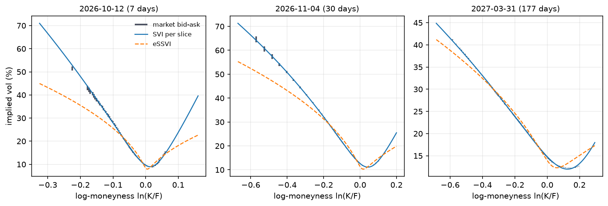

# options-lab

What S&P 500 implied volatility prices: an arbitrage-free surface fitted to a real SPX
chain, and the premium a seller of that volatility has collected since 1990.




**In short**

- The free SVI fit sits 0.13 vol points from the quotes, but its extrapolated wings break no-arbitrage at thousands of grid points; the arbitrage-free SSVI and eSSVI fits pay for being clean with about two points of error (SPX chain of 2026-10-05).
- Across 238 archived sessions (SPX 2022, SPY 2008–2025), eSSVI under the sufficient Hendriks-Martini calendar condition has zero arbitrage on every session, for a median cost of 0.07 vol points on SPX 2022.
- Selling 30-day variance at the VIX since 1990 earned a Sharpe of 1.19 with a skew of −6.17; the worst window, COVID, lost almost three years of average gains.

Rendered report: <https://emiliensabathier.github.io/options-lab/>

## Results

### The surface: closeness to quotes against freedom from arbitrage

One SPX chain captured 2026-10-05 16:09 UTC (15-minute delayed quotes, index at 7,761.75),
42 expiries fitted from one week to just over a year (a 43rd is refused: too few
put-call pairs to pin its forward), 7,425 out-of-the-money quotes after screening. Four models were fitted to the same quotes and audited the same way.

| Model | RMSE (vol pts) | Inside bid-ask | Butterfly arbitrage, quoted / wings | Calendar arbitrage, quoted / wings | 30-day replicated vol |
| --- | --- | --- | --- | --- | --- |
| SVI per slice | 0.13 | 30.0% | 0 / 8,393 | 12 / 8,676 | 16.03 |
| SVI + penalties | 0.60 | 25.1% | 0 / 618 | 596 / 2,982 | 15.29 |
| SSVI | 2.02 | 3.2% | 0 / 0 | 0 / 0 | 15.08 |
| eSSVI | 1.87 | 2.5% | 0 / 0 | 0 / 0 | 15.00 |

Arbitrage counts are grid points out of 1,201 per slice on log-moneyness -0.6 to 0.6:
Durrleman's *g* negative for butterfly, a later slice below an earlier one for calendar.
They are split between the strikes each expiry is quoted at and the wings the model
extrapolates. The CBOE white-paper recipe run on the same chain gives **15.31** against a
published VIX of **15.57**.

There is no free lunch here, and the table says where it is paid for. Five free
parameters per expiry fit the surface to an overall RMSE of 0.13 vol points (0.2 to 0.25 on
the expiries under two weeks, a worst single miss of 1.7) and are nearly clean where the
market quotes, but the wings they extrapolate imply negative densities and crossing slices
on thousands of grid points. The replication integral reads those wings, and the free fit
gives the 30-day vol furthest from the CBOE recipe on the same chain (16.03 against
15.31). Adding penalties, the approach taken by the open-source SVI calibrators this
project started from, removes most of the wing arbitrage but moves calendar violations
inside the quoted range. SSVI is arbitrage-free by theorem. eSSVI is
butterfly-free by construction and, since its fit imposes the sufficient calendar
condition of Hendriks and Martini (2019), calendar-free too: no crossing on this chain or
on any of the 238 archived sessions below. Both cost about two vol points of fit: eSSVI misses
by 2 to 4 points out to one month, about one point at three to six months and under half a
point at one year. Every constrained model, penalised SVI included, misses its worst quote
by about 20 points. One SSVI shape per expiry cannot follow the curvature of a short-dated
smile, and the sufficient butterfly condition it is held to is tight when total variance
is small, which flattens the one-week skew further; how much of the gap each explains is
not separated here.

The chart at the top of this page shows where eSSVI pays for being arbitrage-free: at one week and one month it
sits up to 14 vol points under the deep out-of-the-money puts, the strikes a crash hedge
is bought at. An average error of two points hides that; the picture does not. The free
SVI follows those puts, then turns sharply upward in the call wing it has no quotes for.

### Across sessions: the same audit on archived closes

One afternoon is one draw. The same four fits and the same audit were run on two archives
of end-of-day chains (sources and terms under [Data sources](#data-sources)); per-session
aggregates are in `data/panel/`, the quotes themselves are not redistributed.

**SPX/SPXW, 2022H2, weekly** ([HistoricalData.net](https://historicaldata.net/options.html)
free sample): the first session of each week from 2022-07-01 to 2022-12-27, 25 usable
sessions (2022-09-19 and 2022-12-05 carry two index closes and are skipped), a bear market
with the VIX between 20 and 32, a median 5,455 quotes over 39 expiries per session.

| Model | RMSE median (10–90%) | Inside bid-ask | Sessions with quoted butterfly | Sessions with quoted calendar | Wing violations, median | 30-day vol − VIX, median |
| --- | --- | --- | --- | --- | --- | --- |
| SVI per slice | 0.40 (0.24–0.52) | 23.6% | 5 / 25 | 24 / 25 | 6,916 | +0.07 |
| SVI + penalties | 1.04 (0.40–4.58) | 21.0% | 8 / 25 | 21 / 25 | 2,440 | +1.15 |
| eSSVI | 1.29 (1.16–1.56) | 11.5% | 0 / 25 | 0 / 25 | 0 | −0.37 |
| SSVI | 1.46 (1.31–1.81) | 8.2% | 0 / 25 | 0 / 25 | 0 | −0.38 |

**SPY, 2008–2025** ([lambdaclass/options_backtester](https://github.com/lambdaclass/options_backtester)
archive): the first session of each month from 2008-01-02 to 2025-12-01, 213 sessions,
VIX from 9 to 69. Before 2013 the archive holds a median 617 quotes per session, after it
2,020.

| Model | RMSE median (10–90%) | Inside bid-ask | Sessions with quoted butterfly | Sessions with quoted calendar | Wing violations, median | 30-day vol − VIX, median |
| --- | --- | --- | --- | --- | --- | --- |
| SVI per slice | 0.35 (0.17–6.45) | 51.2% | 79 / 213 | 155 / 213 | 7,208 | +12.91 |
| SVI + penalties | 0.57 (0.24–1.46) | 26.6% | 24 / 213 | 118 / 213 | 1,622 | +35.43 |
| eSSVI | 0.96 (0.37–2.13) | 27.7% | 0 / 213 | 0 / 213 | 0 | −0.19 |
| SSVI | 1.12 (0.53–2.38) | 17.8% | 0 / 213 | 0 / 213 | 0 | −0.10 |

By VIX regime (SPY; median RMSE in vol points):

| VIX regime | Sessions | Ranking holds | SVI | SVI + pen. | eSSVI | SSVI | Recipe − VIX |
| --- | --- | --- | --- | --- | --- | --- | --- |
| below 15 | 63 | 43% | 2.71 | 0.52 | 0.96 | 1.12 | −0.18 |
| 15 to 25 | 109 | 59% | 0.33 | 0.60 | 0.92 | 1.10 | −0.32 |
| 25 and above | 41 | 63% | 0.43 | 0.55 | 1.02 | 1.20 | −0.59 |

By year, the eSSVI and SSVI misses grow with the chains: about half a point in 2008–2011,
when SPY listed a handful of monthly expiries, and two points by 2024–2025, close to the
2026 SPX figure, once weekly and daily expiries put steep short-dated smiles in the fit.
The free fit's 2.71 below a VIX of 15 comes from 2013 and 2015–2017, calm years in which
its yearly median miss is 2.6 to 6.5 points against about 0.6 for penalised SVI.

What carries over from the snapshot, and what does not:

- **The order of fit is stable in pairs, not as a whole.** The full ranking (free SVI,
  penalised SVI, eSSVI, SSVI) holds on 72% of HD sessions and 55% of SPY ones. eSSVI beats
  SSVI on 100% and 96%; free SVI beats penalised SVI on 100% and 72%. Penalised SVI beats
  eSSVI on only 72% and 77%: the penalties sometimes cost more fit than the eSSVI shape
  does.
- **Both SSVI fits are clean everywhere.** Neither has a butterfly or calendar violation
  on any of the 238 sessions, inside the quoted range or in the wings. The free and
  penalised SVI cross in time inside the quoted range on 24 and 21 of 25 HD sessions and on
  155 and 118 of 213 SPY ones.
- **The exact calendar condition costs eSSVI little, and not evenly.** On the sessions
  both runs share (25 HD, 107 SPY), against the old fit that imposed only the necessary
  conditions, its median RMSE moves from 1.27 to 1.29 vol points on HD and stays at 0.66 on
  SPY. Per session the median increase is 0.03 and 0.00 points; the worst are 0.09 (HD,
  2022-08-22) and 1.09 (SPY, 2009-01-02). Sessions with a calendar crossing go from 15 of 25
  and 21 of 107 to none. Each pillar takes whichever of Hendriks and Martini's two
  sufficient branches binds less; with the first branch alone the HD median was 1.34 and
  the worst session cost 0.51, and eSSVI lost to SSVI on 4 of 25 HD sessions. With both it
  loses on none there and on 9 of 213 SPY sessions. The other three models are unchanged to
  the last digit (see [Limitations](#limitations)).
- **Free wings break the replication.** The free and penalised SVI 30-day variances sit
  more than five points above the VIX on 50% and 61% of the SPY sessions and up to 369
  points above it on one HD session; the two SSVI fits stay within three points of the
  index on every session (two for eSSVI). The snapshot's free fit, 16.03 against a VIX of 15.57, was the mild end
- **The CBOE recipe sits a little under the index.** Median −0.28 points on SPX (10–90%:
  −0.42 to −0.01) and −0.32 on SPY, which is not the index's underlying. It finds no
  usable pair of expiries on 12 of 25 HD sessions, on every SPY session before 2013 and on
  14 after;
  those sessions are left out of the gap rather than filled.
- **The two archives are one feed.** On the 127 sessions both cover (July to December
  2022), 1,086,488 SPY contracts match by symbol, every bid is identical, and so is every ask
  present in both (largest absolute difference 0; the 180 exceptions are contracts with a
  blank HD ask, 36 on each of five August sessions; `data/panel/cross_check_spy_2022h2.csv`). Agreement
  between the HD and SPY panels is therefore not independent confirmation.

### The premium: what selling that volatility has earned

A 30-day variance swap struck at every VIX close from 1990, settled on the next 21 trading
days of S&P 500 returns, sampled every 21 days so that windows do not overlap: 440
windows. P&L per unit of vega notional, `(K² − RV) / 2K`, in vol points.

| Statistic | Value |
| --- | --- |
| Mean VIX / mean realized vol | 19.4% / 15.3% |
| Windows with VIX above realized | 84.3% |
| Mean / median seller P&L | 2.72 / 3.91 |
| Worst window | −88.9 |
| Annualised Sharpe | 1.19 |
| Skewness | −6.17 |

These numbers are for windows starting on the first day of the sample. The median
across the 21 possible starting days is a Sharpe of 1.06 and a worst window of −120.

The premium is real and it is not free money: the seller wins five windows in six, and
the worst window takes back almost three years of average gains. The choice of sampling
day is not innocent either: across the 21 possible phases the mean P&L only moves from
2.44 to 2.89, but the Sharpe ranges from 0.59 to 1.25 and the worst window from −66 to
−252. In 20 phases out of 21 that worst window is the COVID crash, and its size depends
only on whether the swap was struck in mid-February 2020, with the VIX still low, or in
early March, after it had already risen.

Regressed in variance, realized on VIX squared gives a slope of **1.01** (White standard
error 0.17) and an intercept of **−0.011** (0.006), R² 0.40. The data cannot reject a
slope of one: VIX squared moves one for one with the variance that follows, shifted up by
a roughly constant premium, rather than over-reacting when volatility is high. The wide
standard error is the honest part of that sentence, and the intercept is itself only
borderline significant (t ≈ −2).

Full report with term structure, parity forwards, the quote ledger and regimes:
[`reports/options.html`](reports/options.html).

## Method

- **Quotes to volatilities.** Forward and discount factor per expiry from put-call
  parity, `C − P = D(F − K)`, regressed on strikes near spot: no rate curve and no
  dividend forecast is assumed. The regression starts from Theil-Sen and trims pairs
  more than four robust deviations off the line, because a handful of stale quotes moves
  an OLS slope by more than the whole funding rate. Premiums are divided by *D* and
  inverted with Black-76 on the forward.
- **Every refused quote is counted.** In-the-money side, under seven days, no bid,
  crossed, spread above half the mid, beyond ±0.6 log-moneyness, last trade more than 30
  days old: each quote is either a volatility or a line in the ledger the report prints.
- **SVI per slice.** Raw SVI in volatility space, residuals scaled by the half spread.
  Started from the quasi-explicit grid of Zeliade (2009): for fixed `(m, σ)` the other
  three parameters solve a linear least squares, so a 2-D grid replaces a blind 5-D
  multi-start.
- **SVI + penalties.** The same fit with Durrleman and calendar penalties on the whole
  moneyness grid, tightened by continuation and started from the previous slice lifted to
  the current at-the-money variance. It is the baseline that open-source calibrators use,
  run here so its residual arbitrage can be measured rather than assumed away.
- **SSVI.** Gatheral-Jacquier power-law SSVI, three shared parameters and one
  at-the-money variance per expiry, constrained to their sufficient no-arbitrage region.
- **eSSVI.** One SSVI slice per expiry, fitted in maturity order in wing-slope
  coordinates `a = ψ(1+ρ)`, `b = ψ(1−ρ)`. Butterfly: `max(a, b) < 4` and
  `(a+b)·max(a, b) ≤ 8θ`. Calendar: `θ`, `a` and `b` non-decreasing and either
  `ψ/θ` non-increasing or the quadratic second inequality, the two sufficient branches of
  Hendriks and Martini (2019), Prop. 3.5; each pillar keeps the branch that binds less. Between two pillars joined by the first
  branch, linear interpolation of `θ`, `ψ` and `ψρ` in time provably preserves both
  conditions; a pair joined by the second has no such proof, so it is kept only if its
  interpolation passes a calendar check on 64 intermediate maturities. The pipeline then
  checks the whole surface on 400 interpolated maturities and the report prints the count
  (zero).
- **The VIX, rebuilt.** The CBOE white-paper recipe on the chain's quotes (stale ones dropped, zero bids kept for the
  recipe's truncation rule), with `e^{RT}` taken
  from the parity discount factor, and the continuous log-contract replication on each
  model's 30-day slice.
- **The premium.** Non-overlapping 21-day windows with sensitivity across all 21
  offsets, a Mincer-Zarnowitz regression in variance terms with White (HC0) errors, and
  results by VIX regime.

### Built on

- [`py_lets_be_rational`](https://github.com/vollib/py_lets_be_rational) (MIT), Peter
  Jäckel's "Let's Be Rational" (2015): implied volatility to machine precision in two
  Householder steps, instead of the Newton-plus-bisection loop most open-source pricers
  carry, which fails silently in the wings where vega vanishes.
- Zeliade Systems, *Quasi-explicit calibration of Gatheral's SVI model* (2009).
- Gatheral and Jacquier, *Arbitrage-free SVI volatility surfaces* (2014); Hendriks and
  Martini, *The extended SSVI volatility surface* (2019).
- CBOE, *VIX White Paper*.
- Open-source SVI calibrators on GitHub for the penalised baseline. Code under copyleft
  licences (AGPL) was read for ideas only; none of it is copied here.

### Data sources

- **2026 capture**: Yahoo Finance via `yfinance`, frozen in `data/raw/`.
- **SPX/SPXW closes, 2022H2**: end-of-day chains from
  [HistoricalData.net](https://historicaldata.net/options.html), free sample, used under
  its licence, which requires this credit and forbids redistributing the data. Only
  per-session aggregates (`data/panel/`) are committed; `scripts/fetch_eod_sample.py`
  downloads the files.
- **SPY closes, 2008-01-02 to 2025-12-12**: the `data-v1` release of
  [lambdaclass/options_backtester](https://github.com/lambdaclass/options_backtester),
  which redistributes it "for research and educational reproducibility". It credits an
  upstream repository, philippdubach/options-data, announced as MIT but no longer online,
  and the data most likely comes from Alpha Vantage. The terms under which the original
  quotes may be reused are therefore not established; this project treats the archive as
  research input, commits only aggregates, and `scripts/fetch_spy_archive.py` downloads it
  from the release. Read with column and date filters, the 25-million-row file never has
  to fit in memory.
- **Three-month Treasury bill** for the SPY discount: FRED series
  [DTB3](https://fred.stlouisfed.org/series/DTB3), public domain, fetched by the same
  script.

## Limitations

Stated because they matter more than the headline numbers.

- **The headline is still one afternoon.** The tables at the top are the 2026-10-05
  capture. The panels below them turn its counts into distributions, but on other data:
  SPX closes from a bear market (2022, VIX mostly 20 to 35) and SPY closes up to
  2025-12-12. Nothing archived covers 2025-12-13 to the capture; the capture itself and
  the daily captures a server takes from 2026-10-06 are the only data for that stretch.
- **SPY is not SPX.** SPY options are American, settle into shares at the 16:00 close and
  pay through a fund that distributes dividends. Put-call parity does not hold for them:
  an in-the-money put sits on its exercise value, and the parity slope read on SPY closes
  gives discount factors from 1.005 to 1.04, which refused most sessions until the method
  changed. For SPY the discount is pinned to the three-month Treasury bill (FRED DTB3,
  one rate for every maturity up to a year) and the forward is read from strikes below
  spot, where the in-the-money leg is a call. Only out-of-the-money quotes enter the
  fits, and their small early-exercise premium is read as volatility. Maturities stop at
  one year, and dividends are absorbed by the forward. SPY trades at about a tenth of
  SPX, so its 30-day variance compares with the VIX, but the CBOE recipe run on SPY is an
  approximation of the index, not the index.
- **The SPY archive has no last-trade date.** The 30-day staleness filter cannot be
  applied, so stale quotes stay in the SPY panel; its arbitrage counts are an upper bound
  next to the SPX ones.
- **The two archives are one feed.** On the 127 sessions both cover, every SPY bid and every ask
  quoted in both is identical (see the panels above). The 2022 overlap is a check that the SPY
  adapter reads what it should, not an independent confirmation.
- **Delayed, and in places stale, quotes.** Yahoo serves 15-minute delayed quotes and
  leaves a contract's bid and ask as they stood at its last trade. Without the 30-day
  last-trade filter the chain shows 367 executable vertical and 594 butterfly arbitrages;
  with it, 0 and 15. The 30-day cutoff is a judgment call, not an estimate.
- **Short-dated rates are noise.** At one week a 0.1% error on the discount factor is a
  five-point error on the implied rate. The parity rate is 3.9–5.6% from three weeks out
  and up to 20% at seven days. It barely moves the undiscounted premium, which is what the
  volatility is read from, but the rate column should not be read as a funding curve.
- **The VIX check is not instantaneous.** The index is live and the quotes are delayed,
  so 15.31 against 15.57 mixes recipe error with fifteen minutes of market.
- **eSSVI's calendar condition is sufficient, not necessary, and is paid for in fit.**
  Non-decreasing `θ`, `a`, `b` is necessary but not enough: with `θ` and `a` flat and `b`
  rising, the later slice dips below the earlier one just right of the money
  (`tests/test_svi.py` holds the counterexample). Before the fix this happened on 15 of 25
  HD and 21 of 107 SPY sessions, on up to 922 and 1,049 quoted grid points. The fit now
  also holds one of the two sufficient branches of Hendriks and Martini (2019), Prop. 3.5:
  `ψ/θ` non-increasing, or a quadratic inequality. It is read through Mingone (2022,
  arXiv:2204.00312, §2.1), because the original was not reachable; Corbetta et al. (2019)
  state only the necessary part. Both branches are still sufficient, not necessary, so the
  fit gives up some arbitrage-free surfaces; that is the RMSE cost reported above.
- **Penalties do not guarantee freedom from arbitrage.** The penalised SVI keeps 596
  calendar violations inside the quoted range. That is a finding about the approach, and
  it is reported rather than tuned away.
- **The VIX is a 30-calendar-day contract settled here on 21 trading days.** The swap
  window is an approximation that ignores holidays and the exact 30-day horizon.
- **Closes are not simultaneous.** VIX settles at 16:15, the S&P 500 at 16:00.
- **VIX before 2003 is back-calculated.** The current methodology was introduced in 2003;
  earlier values were computed after the fact.
- **No transaction costs or margin on the swap.** A real seller pays a spread on entry and
  posts collateral that a −88.9 window would call.

## Running it

```bash
python -m venv .venv
.venv/bin/pip install -e ".[dev]"
.venv/bin/python -m olab --output reports/options.html
```

The full surface run takes about four minutes. Inputs are the frozen captures in
`data/raw/`; `scripts/capture_chain.py` (during US market hours) and
`scripts/capture_history.py` take new ones, with `pip install -e ".[capture]"`.
`scripts/build_readme_chart.py` redraws the chart above.

The session panels need the archives, which are not in the repository (see Data sources):

```bash
pip install -e ".[archive]"
python scripts/fetch_eod_sample.py            # HistoricalData.net SPX/SPXW closes, 2022H2
python scripts/fetch_spy_archive.py           # SPY closes 2008-2025, about 600 MB
python scripts/run_panel.py --source hd --period W
python scripts/run_panel.py --source spy --period M
python scripts/cross_check_sources.py         # needs both
```

Each session takes two to three minutes, most of it in the penalised SVI, and the runner
resumes where it stopped. On a machine with other work running, set
`OPENBLAS_NUM_THREADS=1 OMP_NUM_THREADS=1 MKL_NUM_THREADS=1`: the fits call small linear
algebra kernels many times, and a BLAS that spreads each call over every core made a
session three times slower here, not faster. The report picks up whichever panels exist
in `data/panel/`.

## Tests

```bash
.venv/bin/python -m pytest --cov=src/olab
```

The suite runs offline in under a minute. Unit tests check each piece against a known
answer: a Black chain priced with a given forward, discount and smile must come back out
of the parity regression and the inversion; a flat smile must replicate its own variance;
eSSVI must stay clean between its pillars. A regression test runs the full pipeline on a
frozen six-expiry subset of the chain (`tests/fixtures/`) and compares every number with
those it produced when frozen; `scripts/build_fixture.py` regenerates it after an intended
change.

## Related

Four companion studies, same method: a frozen capture, a rendered report, and a
limitations section longer than the results.

- [portfolio-lab](https://github.com/emiliensabathier/portfolio-lab) — whether any allocation rule beats a static 60/40
- [rates-lab](https://github.com/emiliensabathier/rates-lab) — what the yield curve prices: policy path, inflation, term premium
- [valuation-lab](https://github.com/emiliensabathier/valuation-lab) — what a share price already assumes, by inverting a DCF
- [credit-lab](https://github.com/emiliensabathier/credit-lab) — which default score flags first, against real credit events

## License

MIT.
